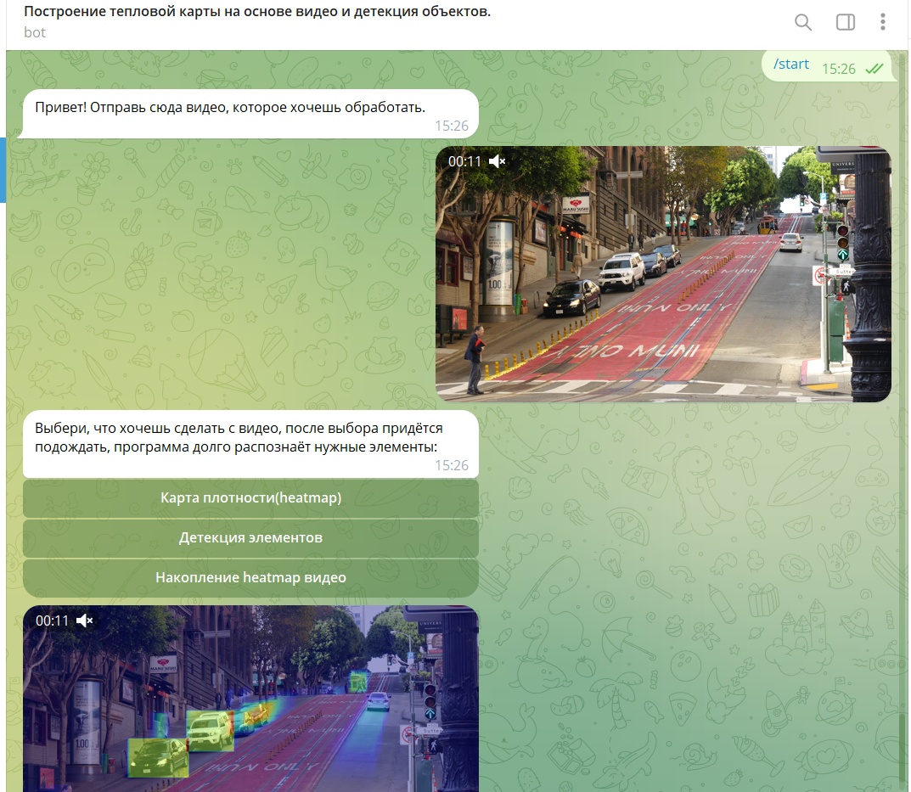

# KurenkovaAnastasiaComputerGraphicks


## Описание бота

Этот бот генерирует карту плотности движения из загруженного видео. Есть функции выгрузить итоговый Heatmap, видео с накоплением Heatmapа или просто детекцию движущихся объектов(машин, людей)


# Телеграм-бот для обработки видео

Этот проект представляет собой телеграм-бота, который обрабатывает видео для создания тепловых карт и выполнения детекции элементов с использованием YOLO. Бот отвечает на видео сообщения и позволяет пользователям выбирать различные режимы обработки.

## Особенности

- **Генерация тепловых карт**: Визуализирует зоны с движением в видео.
- **Детекция элементов**: Определяет и отмечает элементы, обнаруженные моделью YOLO.
- **Накопление видео**: Накопление тепловых карт за несколько кадров.

## Требования

- Установленный Docker на вашем компьютере
- Действительный токен телеграм-бота

## Установка

### Использование Docker

Этот проект содержит Dockerfile для упрощения процесса настройки. Следуйте этим шагам для сборки и запуска приложения в контейнере Docker.

1. **Клонируйте репозиторий**:

    ```bash
    git clone https://git.miem.hse.ru/aakurenkova_5/kurenkovaanastoasiacomputergraphicks.git
    cd kurenkovaanastoasiacomputergraphicks
    ```

2. **Настройте переменные окружения**:

    Дополните файл `.env` в корне проекта с вашим токеном телеграм-бота:

    ```
    TOKEN_BOT=ваш_токен_телеграм_бота
    ```

3. **Соберите образ Docker**:

    Убедитесь, что демон Docker запущен, затем соберите образ Docker:

    ```bash
    docker build -t telegram-bot .
    ```

4. **Запустите контейнер Docker**:

    Используйте следующую команду для запуска контейнера, передавая файл `.env` для переменных окружения:

    ```bash
    docker run --env-file .env telegram-bot
    ```

## Структура проекта

- `requirements.txt`: Содержит список зависимостей Python.
- `telegram_bot_scripts.py`: Основной скрипт, запускающий бота и обрабатывающий видео.

## Ключевые технологии

- **OpenCV**: Для обработки видео и манипуляции кадрами.
- **YOLO с Ultralytics**: Для обнаружения объектов в реальном времени.
- **Python Telegram Bot**: Для взаимодействия с Bot API Telegram.


## Немного интерфейса
Вид бота, которого вы можете создать

## Обратная связь
При возникновении проблем писать на aakurenkova_5@edu.hse.ru.


